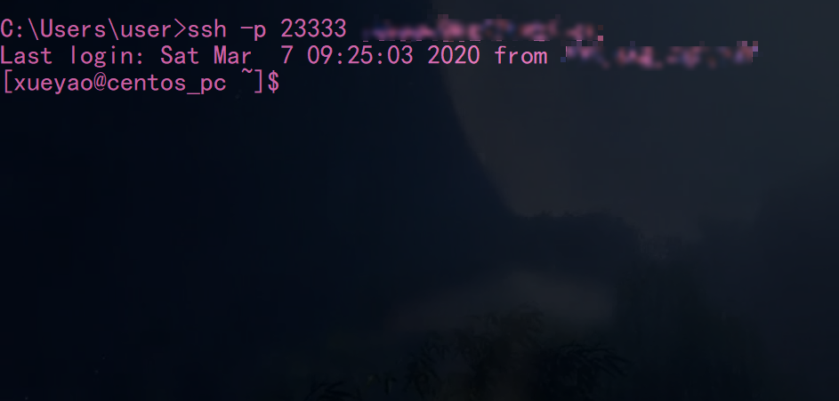

# 基本信息

命令名：`ssh`

服务名：`sshd`

SSH服务器配置文件路径：

`/etc/ssh/sshd_config`


# SSH客户端配置

> OpenSSH有三种配置方式：
> 命令行参数、
> 用户配置文件（~/.ssh/config）
> 系统级的配置文件（/etc/ssh /ssh_config）
>
> 命令行参数优先于配置文件，用户配置文件优先于系统配置文件。所有的命令行的参数都能在配置文件中设置。因为在安装的时候没 有默认的用户配置文件，所以要把 “/etc/ssh/ssh_config”拷贝并重新命名为“~/.ssh/config”。


禁用root登录

自定义端口

# —————————————————————————

## ssh 安全认证是如何工作的？

### 第 一种级别（基于口令的安全验证）

只要你知道自己帐号和口令，就可以登录到远程主机。所有传输的数据都会被加密，但是不能保证你正在连接的服务器就是你想连 接的服务器。可能会有别的服务器在冒充真正的服务器，也就是受到“中间人”这种方式的攻击。

### 第二种级别（基于密匙的安全验证）

需要依靠密 匙，也就是你必须为自己创建一对密匙，并把公用密匙放在需要访问的服务器上。如果你要连接到SSH服务器上，客户端软件就会向服务器发出请求，请求用你的 密匙进行安全验证。服务器收到请求之后，先在你在该服务器的家目录下寻找你的公用密匙，然后把它和你发送过来的公用密匙进行比较。如果两个密匙一致，服务 器就用公用密匙加密“质询”（challenge）并把它发送给客户端软件。客户端软件收到“质询”之后就可以用你的私人密匙解密再把它发送给服务器。

用 这种方式，你必须知道自己密匙的口令。但是，与第一种级别相比，第二种级别不需要在网络上传送口令。

第二种级别不仅加密所有传送的数据， 而且“中间人”这种攻击方式也是不可能的（因为他没有你的私人密匙）。但是整个登录的过程可能需要10秒。


#### 生成密钥对

```shell
#该命令产生的密钥是通过rsa算法加密生成的
ssh-keygen -t rsa 

# 
Generating public/private rsa key pair.
Enter file in which to save the key (C:\Users\user/.ssh/id_rsa): # 这里输入生成的密钥对文件名称， 可以跳过
Enter passphrase (empty for no passphrase): # 私钥密码， 可跳过
Enter same passphrase again: # 重复密码
```

生成的密钥对默认保存在 `~/.ssh/id_rsa*`  拥有`.pub` 后缀的为公钥。

**私钥** 保存在本地主机（ssh客户端）。

**公钥**保存到目标主机（ssh服务器）。

#### 密钥分发：生成认证文件

服务器执行 `cat <公钥文件路径> >> ~/.ssh/authorized_keys ` 把公钥追加到认证文件。

更改权限

```shell
# 修改authorized_keys和.ssh的文件权限
chmod 700 ~/.ssh/
chmod 600 ~/.ssh/authorized_keys
```

重启 `sshd` 服务
```shell
systemctl restart sshd
```

#### 验证登录

在持有**私钥** 的本地机器， 使用ssh命令登录。

```shell
ssh [-P port] [username]@<host>
```


