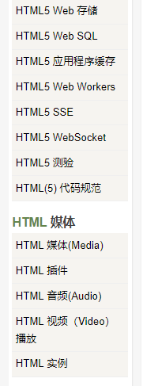

# H5 新增标签

## 布局元素

- header		网页头文件
- nav              导航
- section       节点：章节，页眉，页脚等
- article        独立的内容
- aside       主区域之外的内容
- figcaption  figure的标题，仅有的非块级元素。 包含于figure， 作为第一个子元素 或者最后一个。
- figure      独立的流内容
- footer       页脚


## 表单元素

### input

| 元素           | 描述           | IE   | 火狐 | chrome | sarfari | opera |
| -------------- | -------------- | ---- | ---- | :----- | ------- | ----- |
| **color**      | 颜色选择       |      |      | √      |         | √     |
| **date**       | 日期选择       |      |      | √      | √       | √     |
| datetime       | 日期时间选择   |      |      |        | √       | √     |
| datetime-local | 无时区 时间    |      |      | √      | √       | √     |
| **email**      | 邮件地址       | √    | √    | √      |         | √     |
| **month**      | 月份选择       |      |      | √      | √       | √     |
| **number**     | 数值输入域     | √    |      | √      | √       | √     |
| *range*        | 滑块数值       | √    |      | √      | √       | √     |
| **search**     | 搜索框         |      |      | √      | √       |       |
| tel            | 电话号码       |      |      |        |         |       |
| time           | 时间选择       |      |      | √      | √       | √     |
| url            | URL输入        | √    | √    | √      |         | √     |
| *week*         | 选择一年第几周 |      |      | √      | √       | √     |

### 其他表单元素

| 元素         | 描述               | IE   | 火狐 | chrome | sarfari | opera |
| ------------ | ------------------ | ---- | ---- | ------ | ------- | ----- |
| **datalist** | 可能的选项         | √    | √    | √      |         | √     |
| keygen       | 验证用户，生成密钥 |      | √    | √      | √       | √     |
| output       | 接受计算结果       |      | √    | √      | √       | √     |

### 其他新增属性，见菜鸟教程

https://www.runoob.com/html/html5-form-attributes.html


# web储存

## localStorage

 用于长久保存整个网站的数据，保存的数据没有过期时间，直到手动去除。

## sessionStorage

用于临时保存同一窗口(或标签页)的数据，在关闭窗口或标签页之后将会删除这些数据。


```javascript
不管是 localStorage，还是 sessionStorage，可使用的API都相同，常用的有如下几个（以localStorage为例）：

保存数据：localStorage.setItem(key,value);
读取数据：localStorage.getItem(key);
删除单个数据：localStorage.removeItem(key);
删除所有数据：localStorage.clear();
得到某个索引的key：localStorage.key(index);
```

```javascript
if(typeof(Storage)!=="undefined") {
    // 是的! 支持 localStorage  sessionStorage 对象!
    // 一些代码.....
} else {
    // 抱歉! 不支持 web 存储。
}
```


`localStorage`只要在相同的协议、相同的主机名、相同的端口下，就能读取/修改到同一份localStorage数据。

`sessionStorage`比`localStorage`更严苛一点，除了协议、主机名、端口外，还要求在同一**窗口**（也就是浏览器的标签页）下。


# web SQL

前端数据库，，，  不知道他们想干啥。。。

比如：

```javascript
// 创建数据库
var db = openDatabase('mydb', '1.0', 'Test DB', 2 * 1024 * 1024);
// 创建表
db.transaction(function (tx) {  
   tx.executeSql('CREATE TABLE IF NOT EXISTS LOGS (id unique, log)');
});
// 打开数据库
var db = openDatabase('mydb', '1.0', 'Test DB', 2 * 1024 * 1024);
// 插入数据
db.transaction(function (tx) {
   tx.executeSql('CREATE TABLE IF NOT EXISTS LOGS (id unique, log)');
   tx.executeSql('INSERT INTO LOGS (id, log) VALUES (1, "菜鸟教程")');
   tx.executeSql('INSERT INTO LOGS (id, log) VALUES (2, "www.runoob.com")');
});
```

其他略。

