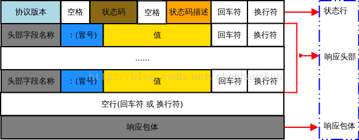

# HTTP请求


例：
```http

```

# HTTP 响应




例：

```http
HTTP/1.1 200 OK
Cache-Control: private, no-cache, no-store, proxy-revalidate, no-transform
Connection: Keep-Alive
Content-Type: text/html
Date: Wed, 13 Nov 2019 06:02:54 GMT
Last-Modified: Mon, 23 Jan 2017 13:27:57 GMT
Pragma: no-cache
Server: bfe/1.0.8.18
Set-Cookie: BDORZ=27315; max-age=86400; domain=.baidu.com; path=/
Transfer-Encoding: chunked
```


```http
HTTP/1.1 200 OK
Bdpagetype: 1
Bdqid: 0xc49b9307001d9250
Cache-Control: private
Connection: Keep-Alive
Content-Type: text/html
Cxy_all: baidu+8baa7568620dfb75f21a702a9553399d
Date: Wed, 13 Nov 2019 06:13:27 GMT
Expires: Wed, 13 Nov 2019 06:13:22 GMT
Server: BWS/1.1
Set-Cookie: delPer=0; path=/; domain=.baidu.com
Set-Cookie: BDSVRTM=0; path=/
Set-Cookie: BD_HOME=0; path=/
Set-Cookie: H_PS_PSSID=1436_21111_29567_29221_26350_22157; path=/; domain=.baidu.com
Strict-Transport-Security: max-age=172800
Traceid: 1573625607025483316214167078711100019280
Vary: Accept-Encoding
X-Ua-Compatible: IE=Edge,chrome=1
Transfer-Encoding: chunked
```

```http
HTTP/1.1 200 
Accept-Ranges: bytes
ETag: W/"2955-1573204030000"
Last-Modified: Fri, 08 Nov 2019 09:07:10 GMT
Content-Type: text/html
Content-Length: 2955
Date: Wed, 13 Nov 2019 06:14:46 GMT
```
