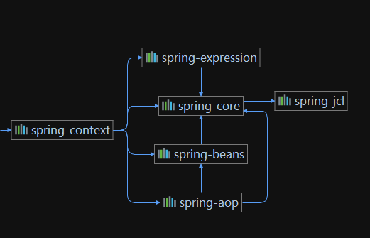
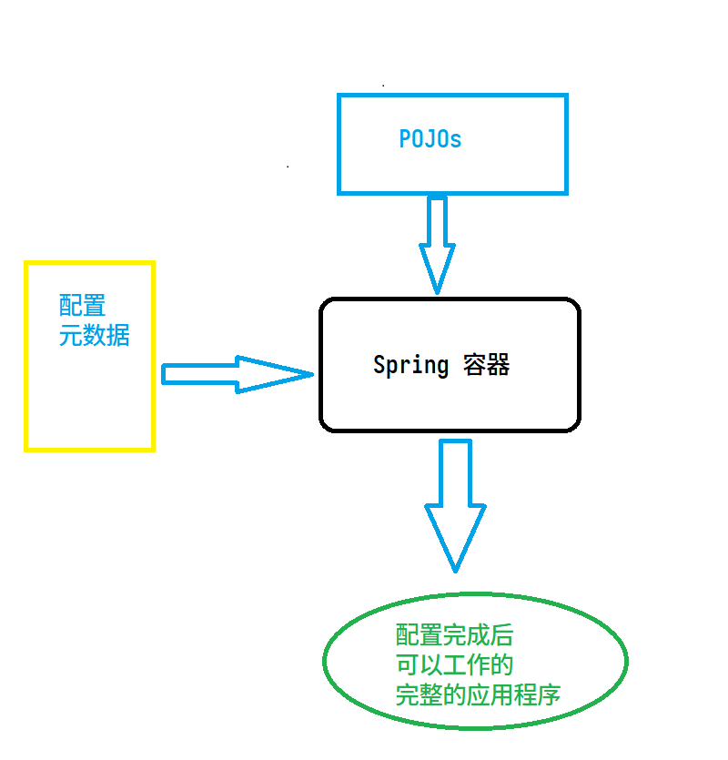

> 以下内容参考:
> [https://www.docs4dev.com/docs/zh/spring-framework/4.3.21.RELEASE/reference/beans.html](https://www.docs4dev.com/docs/zh/spring-framework/4.3.21.RELEASE/reference/beans.html)


## 模块图


> 值得一提: Spring Core 的日志依赖(也是Spring Framework 中唯一强制依赖) 从 Spring 4 中的 JCL 改为了 Spring JCL: Spring 定制的最小化 JCL, 兼容 Log4j 和
> SLF4J
> 也就是说, Spring 5 中不需要手动排除JCL依赖, 引入JCL-Slf4j 桥接器了, 直接使用 SLF4J 即可


# 基础配置

> Spring 支持使用
> - XML 配置;
> - Java 注解配置;
> - 纯 Java 配置;
>
> 可以使用以上任意一种, 或混合使用. 例如可以在XML配置中启用 `component-scan` 同时支持注解配置


## XML 配置

### 配置文件

```xml
<?xml version="1.0" encoding="UTF-8"?>
<beans xmlns="http://www.springframework.org/schema/beans"
       xmlns:xsi="http://www.w3.org/2001/XMLSchema-instance" xmlns:context="http://www.springframework.org/schema/context"
       xsi:schemaLocation="http://www.springframework.org/schema/beans http://www.springframework.org/schema/beans/spring-beans.xsd http://www.springframework.org/schema/context https://www.springframework.org/schema/context/spring-context.xsd">
    <!-- 开启注解扫描 -->
    <context:component-scan base-package="cn.package.name"/>
</beans>

```

### 启动

```java
public static void main(String [] args){
    ApplicationContext context = new ClassPathXmlApplicationContext("application.xml");
}
```

## Java 注解配置

### 常用注解

> Spring 的注解配置, 同时支持Spring 自身注解和 `JSR-330`注解

- `@Bean`
- `@Configuration`
- `@Component` 及其衍生注解: `@Service` `@Repository` `@Controller` `@RestController`
  ### 启动

> 可以使用任意 `@Configruation` 或 `@Component` 类, 或者 包名, 作为构造参数, 启动 `AnnotationConfigApplicationContext` 甚至可以不提供任何参数
>
> Web 应用程序使用 `AnnotationConfigWebApplicationContext`

```java
public static void main(String [] args){
    ApplicationContext context = null;
    
    // 使用包名
    context = new AnnotationConfigApplicationContext("cn.package.name");
    
    // 使用配置类 或 组件类
    context = new AnnotationConfigApplicationContext(ApplicationConfig.class);
    
    
    // 使用空构造
    context = new AnnotationConfigApplicationContext();
    context.register(AppConfig.class, OtherConfig.class);
    context.register(AdditionalConfig.class);
    context.refresh();    
}
```

### 配置Bean 扫描: `@ComponentScan("cn.package.name")`

> 等同于 XML 配置:
> `<**context**:component-scan _base-package_="cn.package.name"/>`


### 配置文件导入: `@Import`

> `org.springframework.context.annotation.Import`
> 等同于XML 配置:
> `<import />`


### 有条件的启动/禁用 配置: `@Profile`

激活方式

```java
ConfigurableApplicationContext context = new AnnotationConfigApplicationContext(Config.class);

context.getEnvironment().setActiveProfiles("");
```

或者使用

- `spring.profiles.active` 属性
- 系统环境变量
- JVM 系统属性
- web.xml 中的 servlet 上下文
- JNDI 条目

### 混合配置, 导入 XML 配置文件: `@ImportResource`

在 XML 中 启用 Java 注解配置, 只需要把 `@Configuration` 类注册到容器, 所有 `@Bean` 会自动注册

```xml
<!-- 启用注解支持 -->
<context:annotation-config/>

<bean class="com.acme.AppConfig"/>
```

# 核心技术: IOC 容器

Spring 实现自身提出的 `IOC(控制反转) `也称: `DI (依赖注入)` 思想, 注入和被注入的对象称为 `Bean`<br />而 Spring 管理这些 `Bean`则用到容器
> 相关类:
> `org.springframework.beans.factory.BeanFactory`
> `org.springframework.context.ApplicationContext`

应用程序提供 `Bean`的定义, 以及 `Bean`之间依赖关系的元数据(可以是XML, 注解, 或Java 配置, Spring 不关心此元数据的提供方式), 经过IOC容器合并后
使应用程序可用<br />

