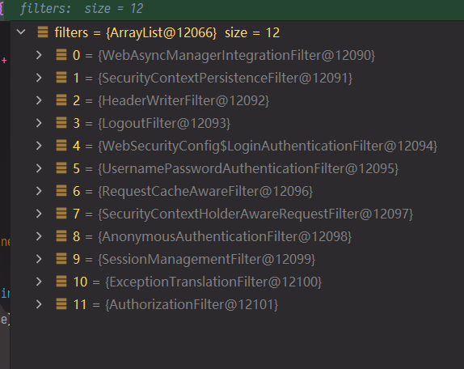
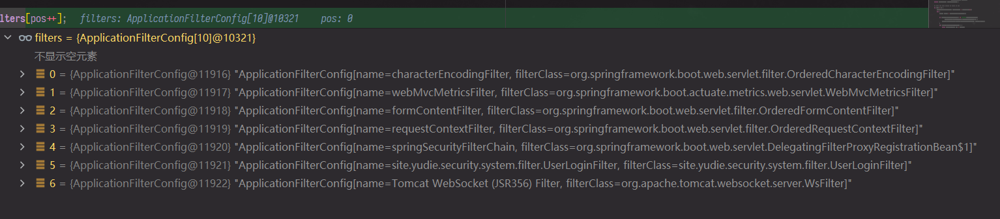

## 拦截器执行流程:

`org.springframework.web.filter.DelegatingFilterProxy` 在这里, 延迟初始化拦截器链,
把请求传递给实例化后的拦截器链代理 ↓ `org.springframework.security.web.FilterChainProxy` 这这里可能会包装 select Request 和 Response
为 `org.springframework.security.web.firewall.FirewalledRequest` 和 `javax.servlet.http.HttpServletResponse`

对包装后的请求和响应, 应用拦截器查找, 从 `this.filterChains` 中 使用 `org.springframework.security.web.SecurityFilterChain#matches`接口进行匹配,
返回匹配的拦截器
> 默认仅包含 `org.springframework.security.web.DefaultSecurityFilterChain` 其中包含大约 12 个拦截器
> 

对每个拦截器逐一尝试, 跳过表示不支持的拦截器 对于认证拦截器, 找到合适的 HttpRequest 后 提取请求参数
包装为特有的 `org.springframework.security.core.Authentication`实现 作为一个认证请求,
委托 `org.springframework.security.authentication.AuthenticationManager`去实现认证

## 认证: AuthenticationManager

## 其他: 关于 Servlet Filter

基础的 Spring Boot + Spring Security 会出现这些拦截器: 
备忘 以后慢慢看 

