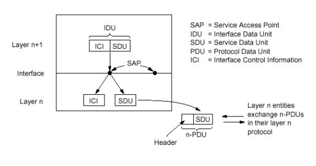

[//]: # (@formatter:off)

<!-- TOC -->
* [第一章 概述](#第一章-概述)
    * [协议](#协议)
    * [TCP (Transmission Control Protocol) - 传输控制协议](#tcp-transmission-control-protocol---传输控制协议)
  * [网络交换方式](#网络交换方式)
    * [线路交换](#线路交换)
    * [分组交换](#分组交换)
      * [分组交换延迟](#分组交换延迟)
      * [延迟诊断](#延迟诊断)
  * [协议层次和服务模型](#协议层次和服务模型)
* [第二章 应用层](#第二章-应用层)
    * [HTTP (Hyper Text Transfer Protocol) 超文本传输协议](#http-hyper-text-transfer-protocol-超文本传输协议)
    * [FTP (File Transfer Protocol) 文件传输协议](#ftp-file-transfer-protocol-文件传输协议)
    * [邮件](#邮件)
    * [DNS (Domain Name System) 域名系统](#dns-domain-name-system-域名系统)
    * [P2P (Peer To Peer) 对等网络](#p2p-peer-to-peer-对等网络)
      * [非结构化P2P](#非结构化p2p)
      * [结构化P2P DHT](#结构化p2p-dht)
    * [CDN (Content Delivery Network) 内容分发网络](#cdn-content-delivery-network-内容分发网络)
  * [TCP 编程](#tcp-编程)
  * [UDP 编程](#udp-编程)
* [第三章 传输层](#第三章-传输层)
  * [概述和传输层服务](#概述和传输层服务)
  * [多路复用与解复用](#多路复用与解复用)
  * [无连接传输: UDP](#无连接传输-udp)
  * [可靠数据传输的原理](#可靠数据传输的原理)
    * [RDT (reliable data transmission) - 可靠数据传输](#rdt-reliable-data-transmission---可靠数据传输)
    * [滑动窗口](#滑动窗口)
  * [面向连接的传输: TCP](#面向连接的传输-tcp)
  * [拥塞控制原理](#拥塞控制原理)
  * [TCP 拥塞控制](#tcp-拥塞控制)
* [第四章 网络层: 数据平面](#第四章-网络层-数据平面)
* [第五章 网络层: 控制平面](#第五章-网络层-控制平面)
* [第六章 链路层和局域网](#第六章-链路层和局域网)
* [网络安全](#网络安全)
<!-- TOC -->

[//]: # (@formatter:on)

# 第一章 概述

### 协议

```
对等层实体在通信时遵守的规则的集合, 这些规则包括: 语法 语义 和 时序
```

互联网是什么: `为分布式应用进程提供通讯服务的基础设施, 包括应用层以下所有协议实体`

### TCP (Transmission Control Protocol) - 传输控制协议

> [RFC 793](https://www.rfc-editor.org/rfc/rfc793.html)

**面向连接**: 端系统维护连接, 中间节点不知道(不维护)  
**有连接**: 所有节点都维护连接

## 网络交换方式

### 线路交换

- 频分多路复用
- 时分多路复用
- 波分多路复用
- 码分多路复用

### 分组交换

- 数据分组 存储转发
- 统计多路复用(特殊时分)

#### 分组交换延迟

- 处理延迟
- 传输延迟(发送/接收)
- 排队延迟
- 传播时延

#### 延迟诊断

Windows:
> ```powershell
> tracert www.baidu.com
> ```
> ```log
> 通过最多 30 个跃点跟踪
> 到 www.a.shifen.com [112.80.248.76] 的路由:
> 
> 1    < 1 毫秒   < 1 毫秒   < 1 毫秒 10.0.0.1
> 2     4 ms     4 ms     2 ms  100.70.0.1
> 3     3 ms     3 ms     3 ms  58.242.194.57
> 4    10 ms     9 ms     9 ms  58.242.195.1
> 5    11 ms    13 ms    12 ms  219.158.106.149
> 6     *        8 ms     *     153.3.228.170
> 7    10 ms    10 ms    14 ms  153.37.96.130
> 8     *        *        *     请求超时。
> 9     9 ms     9 ms     9 ms  112.80.248.76
> ```

Linux:
> ```shell
> traceroute www.bilibili.com
> ```
>
> ```log
> traceroute to www.bilibili.com (112.83.140.11), 30 hops max, 60 byte packets
>  1  ll (172.23.224.1)  0.299 ms  0.259 ms  0.292 ms
>  2  10.0.0.1 (10.0.0.1)  1.366 ms  0.899 ms  1.438 ms
>  3  100.70.0.1 (100.70.0.1)  4.881 ms  4.956 ms  5.013 ms
>  4  58.242.192.117 (58.242.192.117)  3.891 ms 58.242.194.57 (58.242.194.57)  3.948 ms 58.242.193.133 (58.242.193.133)  4.199 ms
>  5  * 58.242.193.73 (58.242.193.73)  11.993 ms *
>  6  219.158.106.149 (219.158.106.149)  14.555 ms 219.158.10.237 (219.158.10.237)  11.170 ms  11.215 ms
>  7  58.241.144.138 (58.241.144.138)  12.352 ms  12.637 ms  12.726 ms
>  8  122.194.113.226 (122.194.113.226)  12.784 ms  12.984 ms  12.799 ms
>  9  * * *
> 10  * * *
> 11  * * *
> 12  112.83.140.11 (112.83.140.11)  15.006 ms  14.922 ms  14.963 ms
> ```

## 协议层次和服务模型

- ISO 七层模型: OSI 开放互联
- TCP/IP 五层模型

<table>
<thead>
    <th>OSI 七层</th>
    <th>TCP/IP 五层</th>
    <th>协议数据单元</th>
</thead>

<tbody>
    <tr>
        <td>应用层 Application Layer</td>
        <td rowspan="3">应用层</td>
        <td rowspan="3"> 报文 (Message) </td>
    </tr>
    <tr> <td>表示层 Presentation  Layer</td> </tr> 
    <tr> <td>会话层 Session  Layer</td> </tr>
    <tr>
        <td>传输层 Transport Layer</td>
        <td>传输层</td>
        <td>报文段 (Segment)</td>
    </tr>
    <tr>
        <td>网络层 Network  Layer</td>
        <td>网络层</td>
        <td>有连接: 分组 (Packet) 无连接 数据报 (Datagram)</td>
    </tr>
    <tr>
        <td>数据链路层 Data Link  Layer</td>
        <td>链路层</td>
        <td>帧 (Frame)</td>
    </tr>
    <tr>
        <td>物理层 Physical  Layer</td>
        <td>物理层</td>
        <td>位 (Bit)</td>
    </tr>
</tbody>
</table>



SAP (Service Accessing Point) 服务访问点   
ICI (Interface Control Info) 接口控制信息  
SDU (Service Data Unit) 服务数据单元  
IDU (Interface Data Unit) 接口数据单元  
PDU (Protocol Data Unit) 协议数据单元

# 第二章 应用层

### HTTP (Hyper Text Transfer Protocol) 超文本传输协议

`TCP:80 443`

- HTTP 1.0 [RFC 1945](https://www.rfc-editor.org/rfc/rfc1945.html)
- HTTP 1.1 [RFC 2068](https://www.rfc-editor.org/rfc/rfc2068.html)
- HTTP 2.0 [RFC 7540](https://www.rfc-editor.org/rfc/rfc7540.html)
- HTTP 3.0 [RFC 9114](https://www.rfc-editor.org/rfc/rfc9114.html)

### FTP (File Transfer Protocol) 文件传输协议

`TCP:20 21`
> [RFC 959](https://www.rfc-editor.org/rfc/rfc959.html)

### 邮件

SMTP 发送  
POP3 / IMAP / HTTP 收取

### DNS (Domain Name System) 域名系统

`UDP:53`

DNS 主要目的:

- `主机名`到`IP地址`的转换  
  `A记录` `AAAA记录`
- `主机名`到`规范名字`转换  
  `CNAME记录`
- `邮件服务器别名`到`邮件服务器正规名字`转换  
  `MX记录`
- 负载均衡

### P2P (Peer To Peer) 对等网络

#### 非结构化P2P

节点之间随意构成逻辑网络

例:

- 集中化目录
- 完全分布式
- 混合式: 核心节点完全分布式, 子节点和核心节点集中式目录

例:

- BitTorrent

#### 结构化P2P DHT

节点之间构成有序结构, 比如环, 树等有序拓扑

### CDN (Content Delivery Network) 内容分发网络

## TCP 编程

## UDP 编程

# 第三章 传输层

## 概述和传输层服务

## 多路复用与解复用

## 无连接传输: UDP

> UDP (User Datagram Protocol) - 用户数据报协议  
> [RFC 768](https://www.rfc-editor.org/rfc/rfc768.html)

## 可靠数据传输的原理

### RDT (reliable data transmission) - 可靠数据传输

**RDT 1.0**  
假设: 信道完全可靠

- 打包

**RDT 2.0**  
假设: 信道不完全可靠, 可能会出错

- 接收确认 `ACK` `NAK`
- 出错重传: 接收校验出错, 确认校验出错, 无法理解的确认

**RDT 2.1**  
假设: 信道不完全可靠, 可能会出错, 可能会丢失

- 发送编号
- `ACK` 编号, 去掉 `NAK` (RDT 2.2)

### 滑动窗口

发送窗口只是发送缓冲区的子集  
接收窗口完全等于接收缓冲区

|                         | 发送窗口 | 接收窗口 | 乱序到达    | 出错重传                |
|-------------------------|------|------|---------|---------------------|
| 停止等待                    | =1   | =1   | 不存在     | 重传最后发送分组            |
| 回退N(Go-back-N)          | \>1  | =1   | 丢弃      | 回退到发送窗口后延, 重新发送所有分组 |
| 选择性重发(Selective Repeat) | \>1  | \>1  | 接收但暂不交付 | 重传错误分组              |

## 面向连接的传输: TCP

> TCP (Transmission Control Protocol) - 传输控制协议  
> [RFC 793](https://www.rfc-editor.org/rfc/rfc793.html)

## 拥塞控制原理

## TCP 拥塞控制

# 第四章 网络层: 数据平面

# 第五章 网络层: 控制平面

# 第六章 链路层和局域网

# 网络安全
