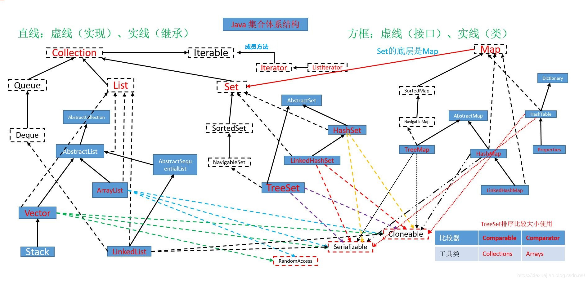

switch

只支持四种数值及其包装类，字符串，枚举。 

不支持long和浮点数。

> required: 'char, byte, short, int, Character, Byte, Short, Integer, String, or an enum'
>
> 必需：**“ char，byte，short，int，Character，Byte，Short，Integer，String或enum”**


# 多态

## 方法重载

### 对于参数类型提升按照一下顺序：

- 正常情况下是  **实参列表和形参列表一一对应**  ，数值字面量默认为int。

- char类型实参，**如果没有对应方法形参为char，char会被转为int** 然后匹配方法。

- 如果可能存在的**实参类型 小于形参，会被自动提升**。

- 如果实参类型大于可能的形参类型， 必须强制转型，否则无法编译（也就是第一种情况了 ╮(╯▽╰)╭）。

    

### 对于可变参数列表：

- **如果实参列表和形参一一对应，则不考虑可能的可变参数。**
- 如果没有一一对应的，尝试可变参数匹配。

### 对于继承和实现：

有如下继承/实现结构：

```java
Object
  ↓
Root
  ↓
Child implements Inter
```

- 同样的，**如果实参和形参类型完全一致，不考虑其他可能。**
- 如果存在实参类型Child， 形参为 Root 或 Objce 或 Inter ，会向上转型。
- 如果存在实参类型Child，形参同时存在Root，Object，Inter 不止一个， 则报错:**Ambiguous method call（方法调用不明确！）**


## 方法重写

- 子类方法权限修饰等级，必须**大于等于父类**方法权限等级。
- 子类重写方法，要么不抛出异常，要么抛出**父类方法异常或其子异常。**
- 子类继承的方法和实现接口的方法有重合的方法声明，则子类要么不抛出异常，要么抛出**父类和接口声明的异常的交集。**

>子类构造器不能捕获基类构造器抛出的异常，只能在子类构造器中声明其会抛出基类构造器的异常或该异常的父类。
>
>如在SubTest的无参构造器中，必须声明抛出IOException或者IOException的父类。此外SubTest的无参构造器还可以声明抛出其他的异常如：NullPointerException。
>————————————————
>版权声明：本文为CSDN博主「nathan_lu」的原创文章，遵循 CC 4.0 BY-SA 版权协议，转载请附上原文出处链接及本声明。
>原文链接：https://blog.csdn.net/randy_lu_lxm/article/details/7884131


# 集合框架


集合是为了统一容器操作方式而生。所以，集合框架的设计中 Collection（采集搜集）包含所有集合通用的操作方式。Set 和List类似。

## Collection 

集合框架的顶层接口，继承了Iterable 迭代器。

| 方法                     | 作用                           |
| ------------------------ | ------------------------------ |
| 两个： add               | 添加元素到集合内               |
| 两个： contains          | 判断集合是否包含传入元素       |
| 三个：remove             | 删除元素                       |
| 两个：stream             | 创建Strean流                   |
| 三个：toArray            | 集合转数组                     |
| clear；size；iterator    | 清空； 元素数量； 获取迭代器。 |
| isEmpty; equals; hasCode | 判空； 比较； 获取哈希码；     |
| retainAll                | 保留全部，删除的变种；         |
| spliterator              | 分离器                         |

## List

有序集合接口 继承于 Collection

新增的方法：

| 方法名             | 作用                                    |
| ------------------ | --------------------------------------- |
| 两个： add         | 添加元素                                |
| 两个：indexOf      | 获取索引                                |
| get； set          | 获取元素， 覆盖元素。                   |
| 两个：listIterator | 获取迭代器                              |
| **sort**           | 排序                                    |
| subList            | 截取                                    |
| 12个：of           | 静态工厂方法，创建不可变集合。 @since 9 |
| copyOf             | 备份 @since 10                          |

## Set

无序列表 继承于 Collection

新增的方法：

| 方法   | 作用                    |
| ------ | ----------------------- |
| copyOf | 备份 @since 10          |
| 12个of | 静态工厂方法， @since 9 |

## Queue

队列， 继承与 Colllection

| 方法             | 作用                                                         |
| ---------------- | ------------------------------------------------------------ |
| peek ；element； | 查看队列头。如果不存在元素，peek 返回null element 抛出异常。 |
| poll； remove    | 检索并删除队列头。 如果不存在，poll返回null  remove 抛出异常 |
| **offer**        | 插入元素， 比add 更好                                        |

## Map

键值对映射， 没有父接口

| 默认方法                                          | 作用                                 |
| ------------------------------------------------- | ------------------------------------ |
| 三个：compute； computeIfAbsent；computeIfPresent | 计算；计算是否不存在；计算是否存在； |
| forEach                                           | 遍历                                 |
| getOrDefault                                      |                                      |
| 。。。                                            |                                      |

| 静态方法  | 作用               |
| --------- | ------------------ |
| copyOf    | 备份，@since 10    |
| 12个： of | 静态工厂，@since 9 |
| 。。。    |                    |


| 方法                       | 作用                                                         |
| -------------------------- | ------------------------------------------------------------ |
| containsKey；containsValue | 包含指定key的映射； 包含指定value 且有一个或多个key映射到value |
| remove                     |                                                              |
| get；                      |                                                              |
| put                        |                                                              |
| iterotor                   |                                                              |
| keySet                     |                                                              |

## 常用实现类



### List：列表

**ArrayList**：底层为数组， 线程不安全。

**LinkedList**：底层为双链表，线程不安全 。

**Vector**：**线程安全**的ArrayList，效率低。

**Stack**：栈，继承自Vector。

### Set：无序列表。

**HashSet**：底层是HashMap

**LinkedHashSet**：底层是HashMap，维护插入的顺序用来迭代。

**TreeSet**：提供一个使用树结构存储Set接口的实现，对象以升序顺序存储，访问和遍历的时间很快。底层是TreeMap。

Queue：队列。

### Map：图，键值对

**HashMap**：哈希表，底层使哈希数组 + 链表 / 红黑树。线程不安全的。

​	初始容量为 16，负载因子为 0.75，当存储元素>容量*负载因子时扩容。

> 在jdk1.8版本后，java对HashMap做了改进，在链表长度大于8的时候，将后面的数据存在红黑树中，以加快检索速度。

**HashTable**：哈希表, 和HashMap类似，**线程安全**的。

TreeMap：TreeMap实现SortMap接口，能够把它保存的记录根据键排序，默认是按键值的升序排序（自然顺序），也可以指定排序的比较器，当用Iterator遍历TreeMap时，得到的记录是排过序的。不允许key值为空，非同步的；

LinkedHashMap：

Properties：属性（.properties文件那种）


# IO 流框架

```java
public abstract class InputStream implements Closeable 
public abstract class OutputStream implements Closeable, Flushable 

public abstract class Reader implements Readable, Closeable
public abstract class Writer implements Appendable, Closeable, Flushable

public class FileInputStream extends InputStream
public class PipedInputStream extends InputStream
public class FilterInputStream extends InputStream 
public class ByteArrayInputStream extends InputStream 
public class SequenceInputStream extends InputStream 
public class ObjectInputStream extends InputStream implements ObjectInput, ObjectStreamConstants

public class FileOutputStream extends OutputStream
public class PipedOutputStream extends OutputStream
public class FilterOutputStream extends OutputStream 
public class ByteArrayOutputStream extends OutputStream 
public class ObjectOutputStream extends OutputStream implements ObjectOutput, ObjectStreamConstants


```


