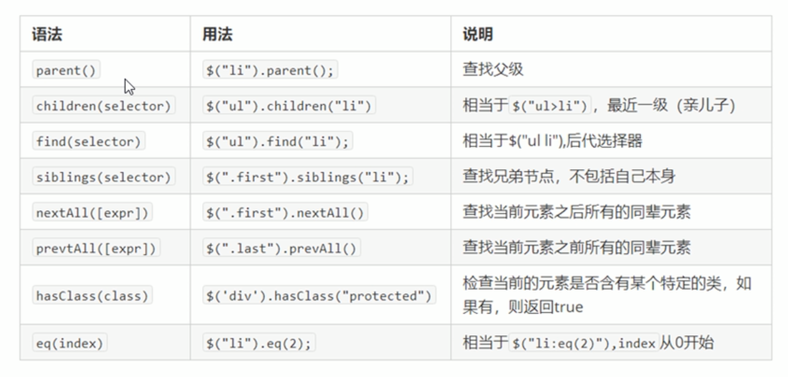

# JQuery 对象和DOM对象

---

>   JQuery 对象只能调用JQuery的方法， DOM只能调用DOM（原生JS ）的方法。
>
>   如果需要调用自己范围之外的，需要转化。
>
>   
>
>   **JQuery 对象是伪数组**


```js
// jQuery 转DOM
$('div')[index]
// 或者
$('div').get(index)

// DOM 转JQuery
$(dom)
```


# jQuery 选择器

---

jQuery 选择器允许您对 HTML 元素组或单个元素进行操作。

## 常用选择器

| 名称       | 用法                | 描述 |
| ---------- | ------------------- | ---- |
| 全局选择器 | $("*")              |      |
| ID选择器   | $("#id")            |      |
| 类选择器   | $(".class")         |      |
| 标签选择器 | $(" div")           |      |
| 并集选择器 | $(" div, ul, form") |      |
| 交集选择器 | $(" div.li")        |      |

## 筛选选择器

| 语法       | 用法          | 描述                        |
| ---------- | ------------- | --------------------------- |
| :first     | $('li:first') | 选取第一个元素              |
| :last      | $('li:list')  | 选取最后一个元素            |
| :eq(index) | $("li:eq(2)") | 选择指定索引的元素，0开始。 |
| :odd       | $("li:odd")   | 选取奇数索引的元素          |
| :even      | $("li:even")  | 选取偶数索引的元素          |

## 筛选方法




# 事件列表

---

## 鼠标事件

| 事件名     | 含义     |
| ---------- | -------- |
| click      | 单击事件 |
| dblclick   | 双击事件 |
| mouseenter |          |
| mouseleave |          |
| hover      |          |

## 键盘事件

| 事件名   | 含义 |
| -------- | ---- |
| keypress |      |
| keydown  |      |
| keyup    |      |

## 表单事件


| 事件名 | 含义 |
| ------ | ---- |
| submit |      |
| change |      |
| focus  |      |
| blur   |      |

## 文档，窗口事件

| 事件名 | 含义 |
| ------ | ---- |
| load   |      |
| resize |      |
| scroll |      |
| unload |      |

不全。。 还有别的。


# 动画

---

## 隐藏显示

```js
// 语法
$(selector).hide(speed,callback);
$(selector).show(speed,callback);
$(selector).toggle(speed,callback);

// speed： 速度，一般为毫秒值。
// callback： 结束回调。

// 隐藏
$("p").hide();
// 显示
$("p").show();
// 显示/隐藏 切换。
$("p").toggle();
```

## 淡入淡出


## 滑动


# HTML 相关

## 获取元素内容

 获得内容 - text()、html() 以及 val()

-   text() - 设置或返回所选元素的文本内容
-   html() - 设置或返回所选元素的内容（包括 HTML 标记）
-   val() - 设置或返回表单字段的值

获取属性 - attr()

```js
$("#btn1").click(function(){
    $("#test1").text("Hello world!");
});
$("#btn2").click(function(){
    $("#test2").html("<b>Hello world!</b>");
});
$("#btn3").click(function(){
    $("#test3").val("RUNOOB");
});
```


## DOM 增删改

我们将学习用于添加新内容的四个 jQuery 方法：

- append() - 在被选元素的结尾插入内容
- prepend() - 在被选元素的开头插入内容
- after() - 在被选元素之后插入内容
- before() - 在被选元素之前插入内容

> append 和 prepend 是在当前元素内部添加（添加子元素）。
>
> after 和 before 是在当前元素外部添加（添加兄弟元素）。

如需删除元素和内容，一般可使用以下两个 jQuery 方法：

- remove() - 删除被选元素（及其子元素）
- empty() - 从被选元素中删除子元素

## jQuery 操作 CSS

jQuery 拥有若干进行 CSS 操作的方法。我们将学习下面这些：

- addClass() - 向被选元素添加一个或多个类
- removeClass() - 从被选元素删除一个或多个类
- toggleClass() - 对被选元素进行添加/删除类的切换操作
- css() - 设置或返回样式属性

## jQuery 尺寸方法

jQuery 提供多个处理尺寸的重要方法：

- width()
- height()
- innerWidth()
- innerHeight()
- outerWidth()
- outerHeight()

  

## DOM遍历

这些 jQuery 方法很有用，它们用于向上遍历 DOM 树：

- parent()
- parents()
- parentsUntil()

下面是两个用于向下遍历 DOM 树的 jQuery 方法：

- children()
- find()

有许多有用的方法让我们在 DOM 树进行水平遍历：

- siblings()
- next()
- nextAll()
- nextUntil()
- prev()
- prevAll()
- prevUntil()